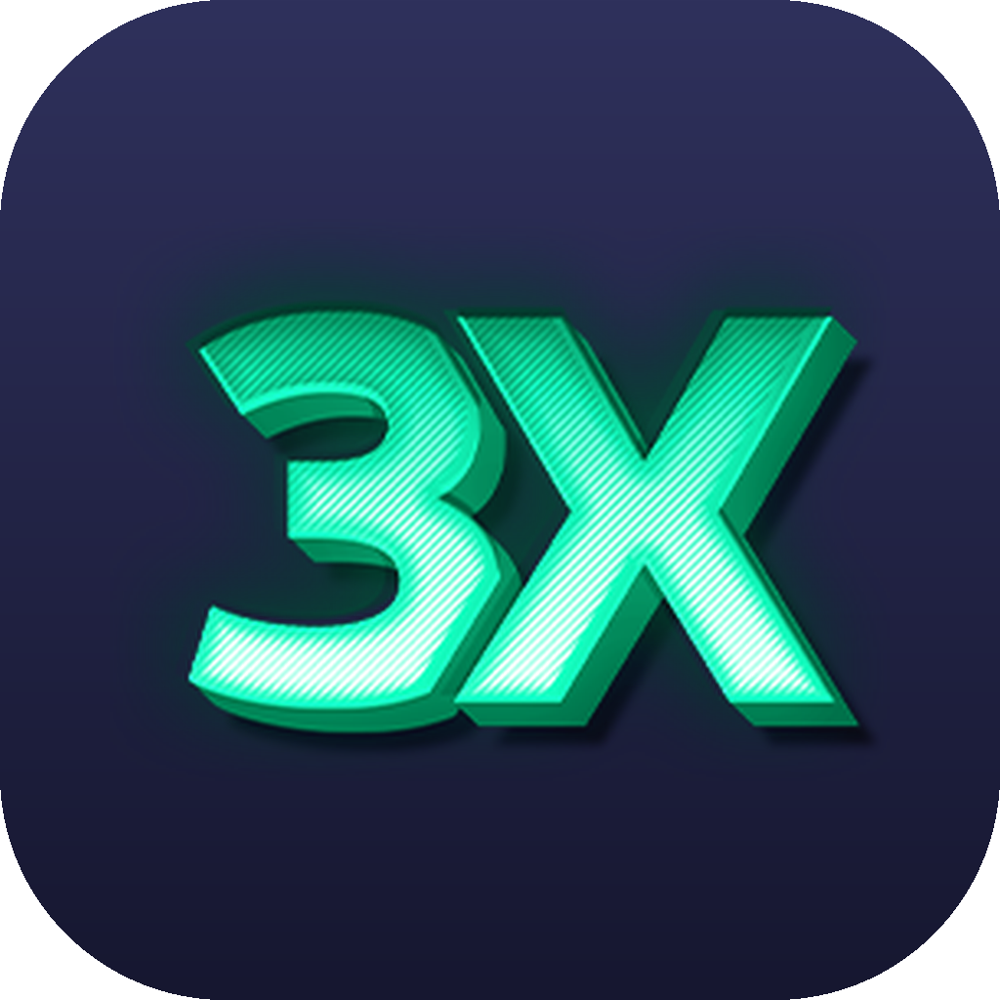
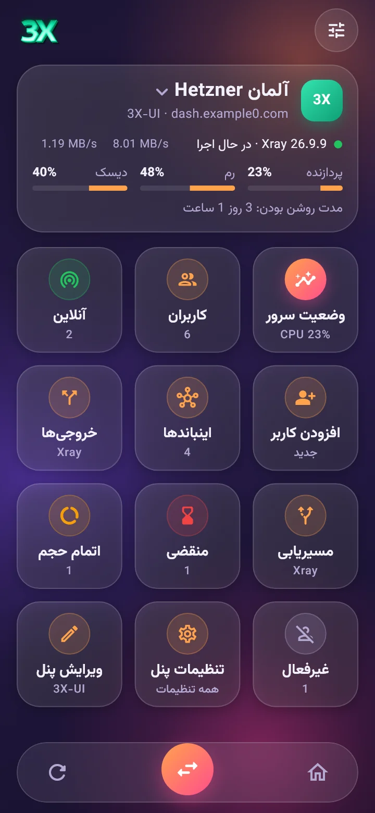
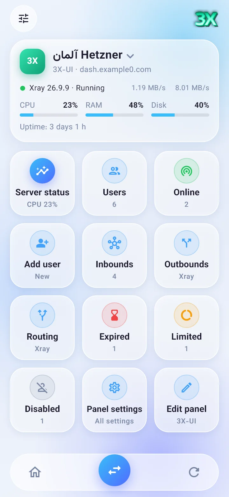
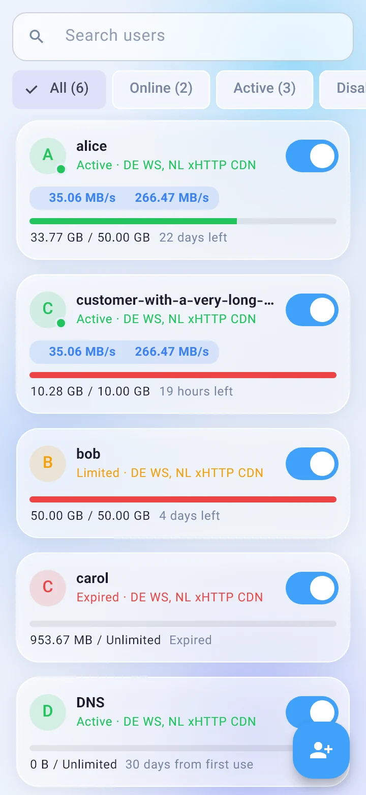
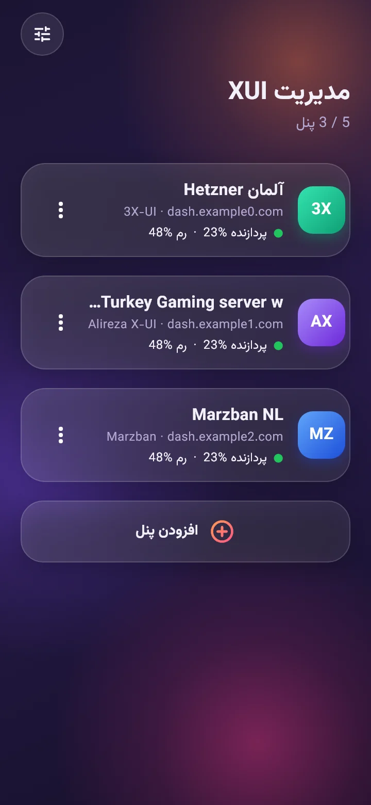
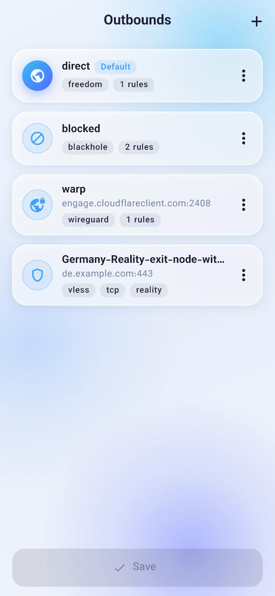
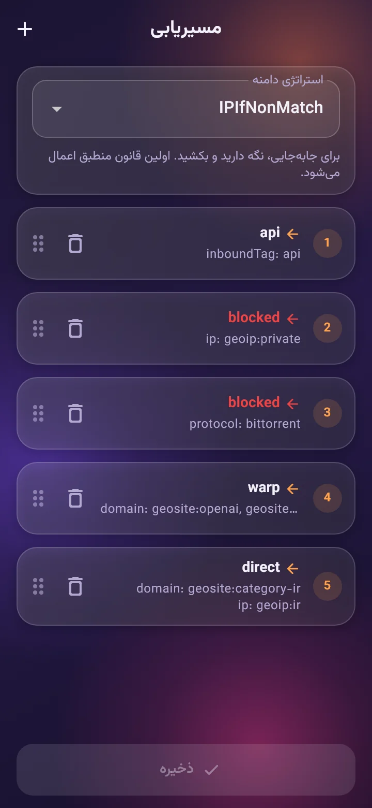
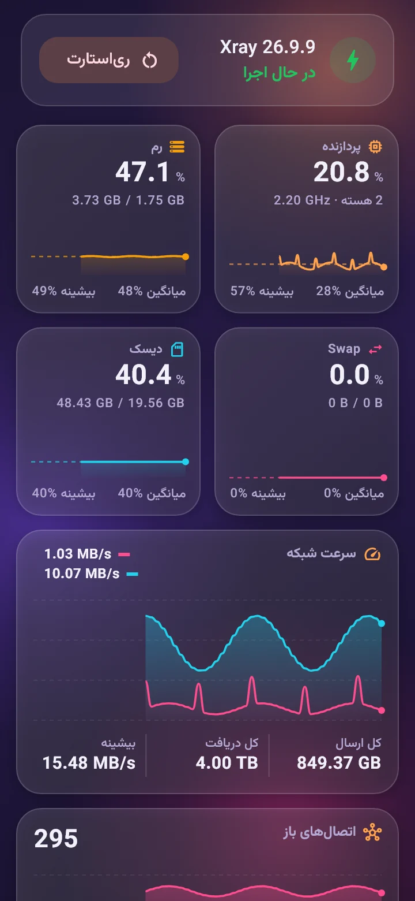
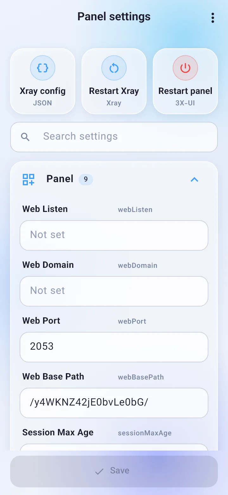
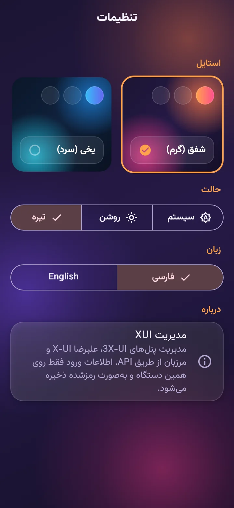

<p align="center">
  
</p>

<h1 align="center">XUI Manager</h1>

<p align="center">
  Manage <b>3X-UI</b>, <b>Alireza X-UI</b> and <b>Marzban</b> panels from your Android phone.<br>
  مدیریت پنل‌های <b>3X-UI</b>، <b>علیرضا X-UI</b> و <b>مرزبان</b> از روی گوشی اندروید.
</p>

<p align="center">
  <a href="https://github.com/Plus98ir/XUI-Manager/releases/latest"><b>⬇️ Download APK / دانلود</b></a> ·
  <a href="https://plus98ir.github.io/XUI-Manager/"><b>🌐 Website / سایت</b></a> ·
  <a href="#english">English</a> ·
  <a href="#فارسی">فارسی</a>
</p>

<p align="center">
  
  
  
</p>

---

## English

A native Android app that talks to your panel's API. Nothing to install on the server: install the app, add your panel's address and log in. Want the panel's own page instead? Each panel can also open as a built-in web panel, like the panel's PWA, but with all your servers in one app.

### Features
- **Panels:** 3X-UI (including 3.x API tokens), Alireza X-UI and Marzban. Up to 20 panels, with a one-tap switcher.
- **Web panel:** open any panel's own web page inside the app, signed in automatically. It works like the panel's PWA, except one app holds all your servers. Choose per panel whether a tap opens the app screens or the web panel.
- **Server status:** live charts for CPU, RAM, swap, disk, network speed and open connections, plus uptime and panel stats. Restart Xray or the panel.
- **Users:** search and filter (online, active, disabled, expired, depleted), add, edit, delete, enable/disable and reset traffic. Live per-user speed. QR codes, subscription links and config links. On 3X-UI 3.x one user can sit on several inbounds (including Hysteria and AmneziaWG), groups are picked from a list, and a whole group or chosen users can be attached to an inbound.
- **Inbounds:** every protocol the panel offers: VLESS, VMess, Trojan, Shadowsocks, Hysteria2, TUIC, WireGuard, AmneziaWG, MTProto, Mixed (SOCKS + HTTP), HTTP, Tunnel and TUN, with TCP, WS, gRPC, xHTTP, TLS and Reality (key generation included). Live speed per inbound.
- **Outbounds:** add from a share link (`vless://`, `vmess://`, `trojan://`, `ss://`), or pick Direct, Block, WARP, SOCKS or HTTP. Edit, reorder and set the default.
- **Routing:** domain strategy, drag-to-reorder rules, and a rule form for domains, IPs, ports, network, protocol and inbound tags.
- **Panel settings:** every panel setting, grouped and searchable, plus the raw Xray config editor.
- **Look:** two glass styles (Aurora and Frost), each in light and dark. Full Farsi and English UI with RTL support.

### Screenshots
| Panels | Outbounds | Routing |
|---|---|---|
|  |  |  |
| **Server status** | **Panel settings** | **Styles** |
|  |  |  |

### Install
1. Open [Releases](https://github.com/Plus98ir/XUI-Manager/releases/latest) and download an APK:
   - `xui-manager-arm64-v8a-release.apk`: most phones from the last few years.
   - `xui-manager-universal.apk`: works everywhere (bigger file).
2. Open the file on your phone and allow installing from this source.
3. If Google Play Protect warns about an unknown app, tap **More details → Install anyway**. The app is open source and built by GitHub Actions from this repository.

Updates install over the previous version and keep your panels.

### Adding a panel
- **3X-UI / Alireza X-UI:** the full panel address including the secret path (for example `https://panel.example.com:2053/secretpath`), then username and password. On 3X-UI 3.x you can use an API token instead.
- **Marzban:** the dashboard address, then admin username and password, or a token.

### Privacy
Panel addresses and credentials are stored only on your phone, in Android's encrypted storage. The app talks only to the panels you add; there are no analytics or third-party servers.

### Build from source
The `android/` folder is generated during the build. See [`.github/workflows/build.yml`](.github/workflows/build.yml):
```bash
flutter create --platforms=android --org com.plus98 --project-name xui_manager .
python3 tool/patch_android.py
flutter pub get
dart run flutter_launcher_icons
flutter build apk --release
```

---

<div dir="rtl">

## فارسی

یک برنامه اندروید که مستقیم با API پنل شما کار می‌کند و چیزی روی سرور نصب نمی‌کند: برنامه را نصب کنید، آدرس پنل را وارد کنید و وارد شوید. اگر صفحه خود پنل را ترجیح می‌دهید، هر پنل به‌صورت پنل وب هم داخل برنامه باز می‌شود؛ مثل PWA پنل، ولی همه سرورها در یک برنامه.

### امکانات
- **پنل‌ها:** 3X-UI (همراه با توکن API نسخه 3.x)، علیرضا X-UI و مرزبان. تا ۲۰ پنل، با جابه‌جایی سریع بین آن‌ها.
- **پنل وب:** صفحه وب خود پنل داخل برنامه باز می‌شود و ورود خودکار انجام می‌شود. مثل PWA پنل است، با این فرق که همه سرورهایتان در یک برنامه‌اند. برای هر پنل انتخاب کنید با زدن روی آن صفحه‌های برنامه باز شود یا پنل وب.
- **وضعیت سرور:** نمودار زنده CPU، رم، Swap، دیسک، سرعت شبکه و اتصال‌های باز، به‌همراه مدت روشن بودن و آمار پنل. ری‌استارت Xray یا پنل.
- **کاربران:** جستجو و فیلتر (آنلاین، فعال، غیرفعال، منقضی، اتمام حجم)، افزودن، ویرایش، حذف، فعال/غیرفعال کردن و ریست ترافیک. سرعت زنده هر کاربر. QR کد، لینک اشتراک و لینک کانفیگ. در 3X-UI 3.x هر کاربر می‌تواند به چند اینباند (از جمله Hysteria و AmneziaWG) وصل شود، گروه از لیست انتخاب می‌شود، و می‌توان یک گروه کامل یا کاربران دلخواه را به یک اینباند اضافه کرد.
- **اینباندها:** همه پروتکل‌های پنل: VLESS، VMess، Trojan، Shadowsocks، Hysteria2، TUIC، WireGuard، AmneziaWG، MTProto، Mixed (SOCKS + HTTP)، HTTP، Tunnel و TUN، با TCP، WS، gRPC، xHTTP، TLS و Reality (همراه با ساخت کلید). سرعت زنده هر اینباند.
- **خروجی‌ها (Outbound):** افزودن از روی لینک کانفیگ (`vless://`، `vmess://`، `trojan://`، `ss://`) یا انتخاب مستقیم، مسدود، WARP، SOCKS و HTTP. ویرایش، جابه‌جایی و تعیین خروجی پیش‌فرض.
- **مسیریابی (Routing):** استراتژی دامنه، جابه‌جایی قانون‌ها با کشیدن، و فرم قانون برای دامنه، آی‌پی، پورت، شبکه، پروتکل و تگ اینباند.
- **تنظیمات پنل:** همه تنظیمات پنل، دسته‌بندی‌شده و قابل جستجو، به‌علاوه ویرایشگر کانفیگ Xray.
- **ظاهر:** دو استایل شیشه‌ای (شفق و یخی)، هرکدام با حالت روشن و تیره. رابط کامل فارسی و انگلیسی با پشتیبانی راست‌به‌چپ.

### نصب
1. از بخش [Releases](https://github.com/Plus98ir/XUI-Manager/releases/latest) یکی از فایل‌ها را دانلود کنید:
   - `xui-manager-arm64-v8a-release.apk`: برای بیشتر گوشی‌های چند سال اخیر.
   - `xui-manager-universal.apk`: روی همه گوشی‌ها کار می‌کند (حجم بیشتر).
2. فایل را روی گوشی باز کنید و اجازه نصب از این منبع را بدهید.
3. اگر Google Play Protect هشدار داد، روی **More details** و بعد **Install anyway** بزنید. برنامه متن‌باز است و GitHub Actions آن را از همین مخزن می‌سازد.

نسخه‌های جدید روی نسخه قبلی نصب می‌شوند و پنل‌های شما حفظ می‌شوند.

### افزودن پنل
- **3X-UI / علیرضا X-UI:** آدرس کامل پنل همراه با مسیر مخفی (مثلاً `https://panel.example.com:2053/secretpath`)، سپس نام کاربری و رمز. در 3X-UI 3.x می‌توانید به‌جای آن توکن API وارد کنید.
- **مرزبان:** آدرس داشبورد، سپس نام کاربری و رمز ادمین، یا توکن.

### حریم خصوصی
آدرس پنل‌ها و اطلاعات ورود فقط روی گوشی خودتان و در حافظه رمزشده اندروید ذخیره می‌شود. برنامه فقط با پنل‌هایی که خودتان اضافه می‌کنید ارتباط دارد و هیچ آمارگیر یا سرور شخص ثالثی ندارد.

</div>
